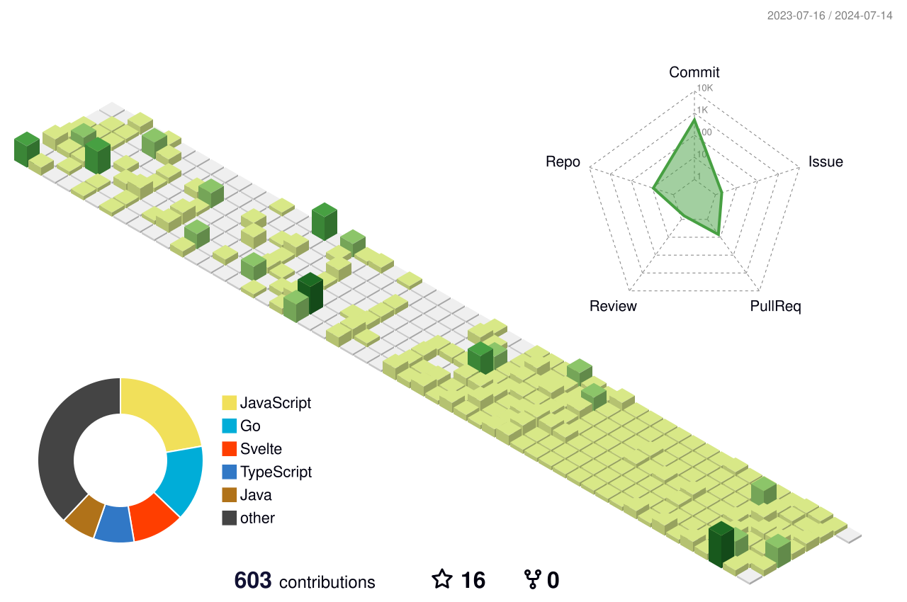

# shyunku

### Curious enough to open the black box.

When something catches my attention, I keep following it — 
from the interface to the protocol, and from the product to the system underneath.

---

## Where curiosity takes me

| | Direction | What I tend to explore |
| :---: | --- | --- |
| 🖥️ | **Applications** | How an idea becomes an interface I can touch and test |
| ⚙️ | **Systems** | What happens behind an API, a real-time service, or a stream of data |
| 🧰 | **Tools** | Parsers, simulators, libraries, and automation for problems I want to understand |
| 🧪 | **Rabbit holes** | Games, cryptography, blockchain, and whatever feels worth taking apart |

## Selected work

| Project | What it is | Area |
| --- | --- | --- |
| [**team.gg**](https://github.com/shyunku/teamgg) | A League of Legends platform that grew from match history into custom-team statistics, ROFL parsing, and AI-assisted replay analysis | Game Platform · Data Analysis |
| [**Fluid**](https://github.com/shyunku/fluid) | A from-scratch exploration of React internals: virtual DOM, Fiber reconciliation, hooks, routing, and an in-browser JSX transformer | UI Runtime · Learning Project |
| [**Thread**](https://github.com/shyunku/thread) | One task-management idea followed across Electron, React Native, a Go sync server, and release and administration services | Productivity · Cross-platform |
| [**CushionBot**](https://github.com/shyunku/CushionBot) | A Java Discord bot that expanded into per-server music, League custom-game coordination, recruiting, and activity monitoring | Community Tool · Automation |

> The stack changes from project to project. The pattern does not: find an interesting question, then follow it further than expected.

## Tools I work with

**Applications & interfaces**

**Services & data**

<strong>More technologies I have worked with</strong>

 

## GitHub activity

  <picture>
    <source media="(prefers-color-scheme: dark)" srcset="./profile-3d-contrib/profile-night-green.svg" />
    <source media="(prefers-color-scheme: light)" srcset="./profile-3d-contrib/profile-green.svg" />
    
  </picture>

  <picture>
    <source media="(prefers-color-scheme: dark)" srcset="https://github-profile-summary-cards.vercel.app/api/cards/stats?username=shyunku&theme=github_dark" />
    <source media="(prefers-color-scheme: light)" srcset="https://github-profile-summary-cards.vercel.app/api/cards/stats?username=shyunku&theme=github" />
    
  </picture>
  <picture>
    <source media="(prefers-color-scheme: dark)" srcset="https://github-profile-summary-cards.vercel.app/api/cards/repos-per-language?username=shyunku&theme=github_dark" />
    <source media="(prefers-color-scheme: light)" srcset="https://github-profile-summary-cards.vercel.app/api/cards/repos-per-language?username=shyunku&theme=github" />
    
  </picture>

## Elsewhere on GitHub

- [**shyunku-libraries**](https://github.com/shyunku-libraries) — maintained libraries and reusable packages
- [**shyunku-archives**](https://github.com/shyunku-archives) — older and retired projects kept for reference

  Still following the next interesting question.

