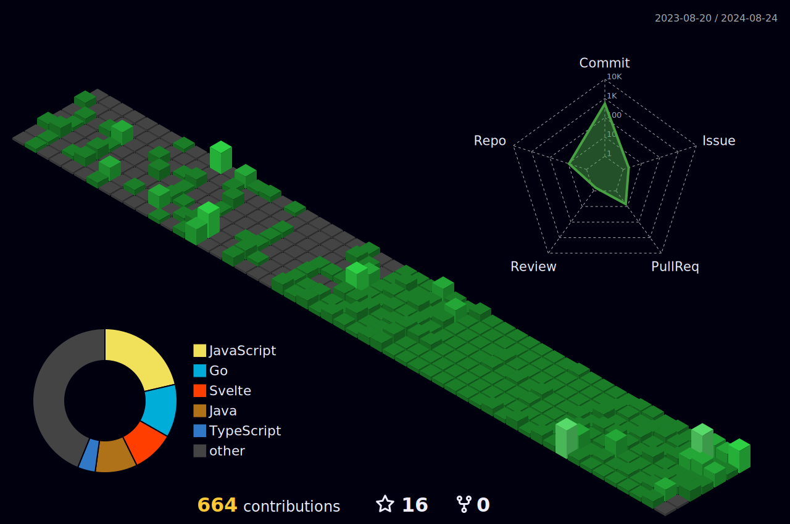

  

  
  

 
<h3 align="center" style="margin-top: 30px">Tech Stacks</h3>

  
  
  
  
  
  

  
  
  
  
  

  
  
  

  
  
  
  

  
  

  
  
  

 
<h3 align="center" style="margin-top: 40px">Other activities</h3>

  
  
  

 
<h3 align="center" style="margin-top: 40px">Git activities</h3>

  
  

## Other accounts

- [shyunku-archives](https://github.com/shyunku-archives): archive my old, expired projects & repositories
- [shyunku-libraries](https://github.com/shyunku-libraries): lists libraries I made officially

## Activities

